  

<h1 align="center">Saad Mansoori</h1>

<b>Full Stack Developer · AI Chatbot & Automation Engineer</b> · Workup Solutions

  
  
  

**What I build:** full stack web platforms (CMS, attendance and employee management) AI chatbots that sit inside real products, and automation workflows, using React, Next.js, Node.js and MongoDB. Based in Karachi, Pakistan.

## 🧬 What I do

- 🏛 **Management systems:** attendance (AMS) and employee management (EMS), built inside a CMS
- 📚 **Research publishing:** Qalam, a platform for research papers
- 🤖 **AI chatbots:** embedded in school, government and university products, including bilingual (EN/UR) support

## ⚡ Systems

| System | What it does | Status |
|---|---|---|
| **AMS**: Attendance Management System | Attendance tracking, built inside a CMS | 🟢 Live |
| **EMS**: Employee Management System | Employee records and operations, built inside a CMS | 🟢 Live |
| **Qalam** | Research paper publication platform | 🟢 Live |
| **TIIA: Brazil schooling system** | School management platform with an AI chatbot | 🟢 Live |
| **TIIA: Brazil government project** | Government platform with an AI chatbot | 🟢 Live |
| **[JUW IPE website](https://github.com/Saad-Mansoori/juw-ipe-website)** | Jinnah University for Women IPE site, courses, admissions, bilingual chatbot | 🟢 Live |
| **JUW homepage chatbot** | Chatbot on the university homepage | 🟢 Live |

## 🛠 Arsenal

**Frontend**

**Backend & data**

**AI**

**Ops & automation**

## 🐍 Contribution graph

<picture>
  <source media="(prefers-color-scheme: dark)" srcset="https://raw.githubusercontent.com/Saad-Mansoori/Saad-Mansoori/output/github-snake-dark.svg" />
  
</picture>

---

📫 **saadmansoori015@gmail.com**

---

<h3 align="center">Work with me</h3>

  
  
  

Source code for client systems is available under NDA.

